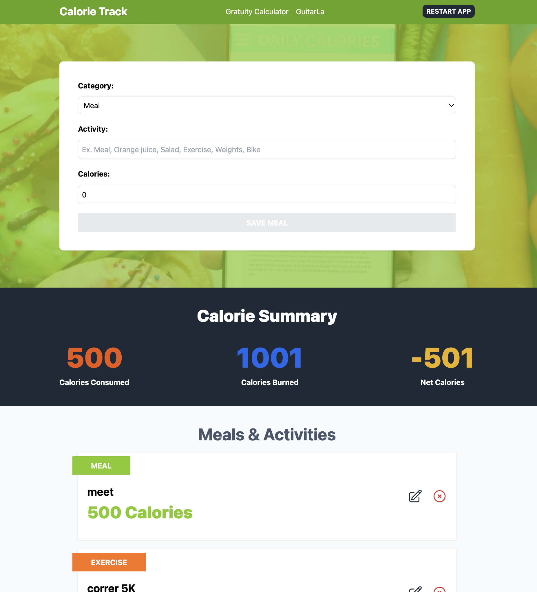

# CalorieTrack - TypeScript

**CalorieTrack** is an interactive web application built with **React** and **TypeScript**, using **Vite** as the build tool. The application is deployed on **Netlify** and can be accessed via the following URL:

**[CalorieTrack - Live Demo](https://gentle-puppy-0e63e3.netlify.app/)**




## Table of Contents
- [Description](#description)
- [Features](#features)
- [Technologies Used](#technologies-used)
- [Hooks Used](#hooks-used)
- [Installation](#installation)
- [Usage](#usage)
- [Contributing](#contributing)
- [License](#license)

## Description
CalorieTrack is a web application designed to help users track their daily caloric intake and expenditure. Users can easily add foods and physical activities to a list, specifying the number of calories consumed or burned. The app automatically calculates the daily calorie balance, allowing users to manage their caloric intake and physical activity to achieve their health and fitness goals.

## Features
- Add and track foods consumed with their caloric values.
- Add and track physical activities with calories burned.
- Real-time calculation of daily calorie balance.
- Intuitive and user-friendly interface designed with Tailwind CSS.
- Optimized for performance with React hooks.

## Technologies Used
- **React**: v18.3.1, a JavaScript library for building user interfaces.
- **TypeScript**: Enhances JavaScript by adding static type definitions.
- **Vite**: A fast build tool that offers a modern development experience.
- **Tailwind CSS**: v3.4.10, a utility-first CSS framework for rapid UI development.
- **Netlify**: A platform for deploying and hosting web applications.

## Hooks Used

### `useState`
`useState` is a React hook that allows you to add state to functional components. It's used in this app to manage the state of food items, activities, and calorie totals.

### `useEffect`
`useEffect` is a React hook that allows you to perform side effects in function components, such as fetching data or subscribing to events. In this app, it is used to update the calorie balance whenever the user adds or removes items from the list.

### `useMemo`
`useMemo` is a React hook that memorizes the result of a computation to avoid unnecessary re-calculations. In this app, it optimizes performance by ensuring that the calorie balance is only recalculated when the inputs change.

### `useReducer` and `Dispatch`
`useReducer` is a hook that provides a more advanced way of managing state in complex components by using a reducer function. Combined with `Dispatch`, it is used in this app to handle complex state logic, such as adding, removing, or updating food items and activities in a controlled and predictable manner.

## Installation

To run the project locally, follow these steps:

1. Clone the repository:
    ```bash
    git clone https://github.com/RicardoTrejoSanjuan/calorie-track.git
    ```

2. Navigate into the project directory:
    ```bash
    cd calorie-track
    ```

3. Install dependencies:
    ```bash
    npm install
    ```

4. Start the development server:
    ```bash
    npm run dev
    ```

5. Open your browser and go to `http://localhost:5173` to access the application.

## Usage

1. Add food items to the list with their respective calorie values.
2. Add physical activities with the number of calories burned.
3. The app will calculate your daily calorie balance automatically.
4. Monitor your progress and adjust your activities or intake accordingly.

## Contributing

Contributions are welcome. If you wish to improve this project:

1. Fork the repository.
2. Create a new branch (`git checkout -b feature/new-feature`).
3. Make your changes and commit them (`git commit -m 'Add new feature'`).
4. Push the branch (`git push origin feature/new-feature`).
5. Open a pull request.

## License

This project is licensed under the [MIT License](LICENSE).
